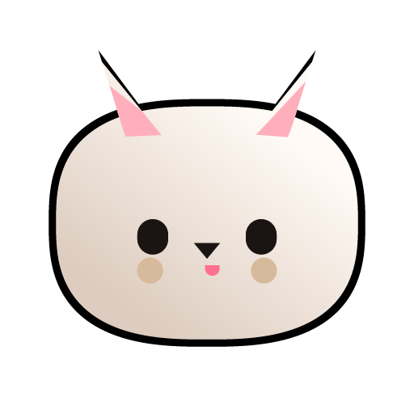

<div align="center">



# Awuuu 🐾

**Your loyal AI dog companion and dynamic island living at the top of your screen on Windows.**
*Connected directly to your local Hermes Agent and watching over your Claude Code & AGY sessions.*

Approve permissions with 1 click, chat with your full-context Hermes Agent, drop files, and watch your companion react — all without leaving your workflow.


</div>

---

## 🐶 Meet Awuuu

**Awuuu** is an expressive, adorable dog companion (บางทีก็หมาต๋อง, หมาป่า, หมาบ้า, หมาน่ารัก) that peeks out from the top edge of your screen. Awuuu has animated floppy/perky ears with spring physics, a wagging tail, a cute black snout, a panting tongue (blep), and an expressive howling mouth when excited!

### ⚡ Powered by Local Hermes Agent

Unlike generic chat apps, Awuuu connects directly to your running **local Hermes Agent** (`http://127.0.0.1:8642`) with **0ms startup lag**:
- **Full Context & Memory**: Hermes Agent on your server (`thanawat`) knows who you are, your memories, projects, and active tasks.
- **Tools & Subagents**: Seamless access to terminal, browser, skill sync, and subagent orchestration.
- **Zero API Cost for Local Hermes**: Connects directly via the local NSSM `HermesGateway` service using `API_SERVER_KEY` discovered automatically from `%LOCALAPPDATA%\hermes\.env`.

---

## ✨ Features

- 🐕 **Awuuu the Dog Mascot** — 60 FPS HTML5 Canvas 2D engine with spring physics, animated dog ears with twitching physics, cute snout & nose, wagging tail behind the body, and panting tongue.
- 🤖 **Claude Code & AGY, Live** — see every session at the top of your screen: tool calls, file edits, and shell commands.
- ✅ **1-Click Approvals** — permission prompts show up instantly with **Allow / Deny** buttons so you never have to context-switch to the terminal.
- 💬 **Direct Hermes Chat** — talk directly to your Hermes Agent with file drops and window context support.
- 🔊 **28 Custom Procedural Sounds** — 100% royalty-free open-source sound effects including puppy howls ("Awuuu!"), alert barks, happy tail-wag confirmation chirps, and collar chimes.
- 🫥 **Non-intrusive & Sleek** — retracts seamlessly into the top notch when idle; peeks out when your cursor approaches the top edge.
- 🔒 **Private & Secure** — runs 100% locally on your machine. API keys and tokens are stored in the **Windows Credential Manager**.

---

## 🚀 Getting Started

### Prerequisites

- [Rust](https://rustup.rs)
- [Node.js 20+](https://nodejs.org)
- Visual Studio Build Tools with **"Desktop development with C++"**
- Windows 10/11 (WebView2 included by default)
- Local Hermes Agent service running (`HermesGateway` on `http://127.0.0.1:8642`)

### Build & Run from Source

```powershell
cd windows
npm install
npm run tauri dev    # Launch live dev mode
```

To build a production standalone installer:

```powershell
npm run pack         # NSIS installer generated in windows/release/
```

---

## 🛠️ Configuration & Setup

Click the **Awuuu** tray icon in your Windows taskbar → **Settings…**:

1. **Claude Code & AGY Hooks**: Click **Install hooks** to register `awuuu-hook.exe` into `%USERPROFILE%\.claude\settings.json`. A dated backup is created automatically.
2. **Hermes Agent Connection**:
   - URL: `http://127.0.0.1:8642/v1/chat/completions` (default)
   - Model: `hermes-agent` (default)
   - Secret key: Automatically discovered from `%LOCALAPPDATA%\hermes\.env` (`API_SERVER_KEY`), or can be stored in Windows Credential Manager under `hermes-api-key`.
3. **Optional Anthropic API**: If you select a `claude-*` model, you can provide an Anthropic API key saved securely into Windows Credential Manager.

---

## 🏗️ Architecture

```
                       ┌────────────────────────┐
                       │   Windows Top Island   │
                       │ (Awuuu Canvas 2D + UI) │
                       └───────────▲────────────┘
                                   │ IPC (Tauri 2)
                       ┌───────────▼────────────┐
                       │      Awuuu Backend     │
                       │     (Rust / Win32)     │
                       └─────┬────────────┬─────┘
                             │            │
            Named Pipe       │            │ Local HTTP REST
   \\.\pipe\awuuu-<sid>      │            │ http://127.0.0.1:8642
                             ▼            ▼
                     ┌──────────────┐   ┌───────────────────────────┐
                     │  awuuu-hook  │   │  Local Hermes Agent (:8642)│
                     │  (Claude /   │   │  - NSSM HermesGateway     │
                     │   AGY Relay) │   │  - Memories, Skills, Tools│
                     └──────────────┘   └───────────────────────────┘
```

- **Island Window**: Borderless, transparent Tauri 2 window with Win32 `WS_EX_TOOLWINDOW` and `WS_EX_NOACTIVATE` so it never steals focus from your IDE or terminal.
- **Relay**: Ultra-fast `awuuu-hook.exe` communicating over local named pipes (`\\.\pipe\awuuu-<sid>`). Never blocks Claude Code sessions (300ms timeout fallback).
- **Procedural Sound Engine**: 28 custom audio waveforms synthesized mathematically in `scripts/gen_dog_sounds.py`.

---

## 🙏 Credits & Attribution

- **Original Project**: Forked and reimagined from [Coucou](https://github.com/Louis-CFM/coucou) by **Louis Raillé** ([louisraille.fr](https://louisraille.fr)), licensed under the **MIT License**.
- **Awuuu Customization**: Rebranded and extended by **Thanawat (Owen)** to support native Hermes Agent integration, the new Awuuu the Dog character design, procedural sound system, and custom icon set.
- Respecting the [LICENSE-ASSETS.md](LICENSE-ASSETS.md) guidelines: Awuuu features a completely original character design, new name, custom icons, and fresh open-source audio.

---

## 📄 License

- **Code:** [MIT License](LICENSE) © 2026 Thanawat & Louis Raillé.
- **Character, Icons, and Audio:** MIT License © 2026 Thanawat.
